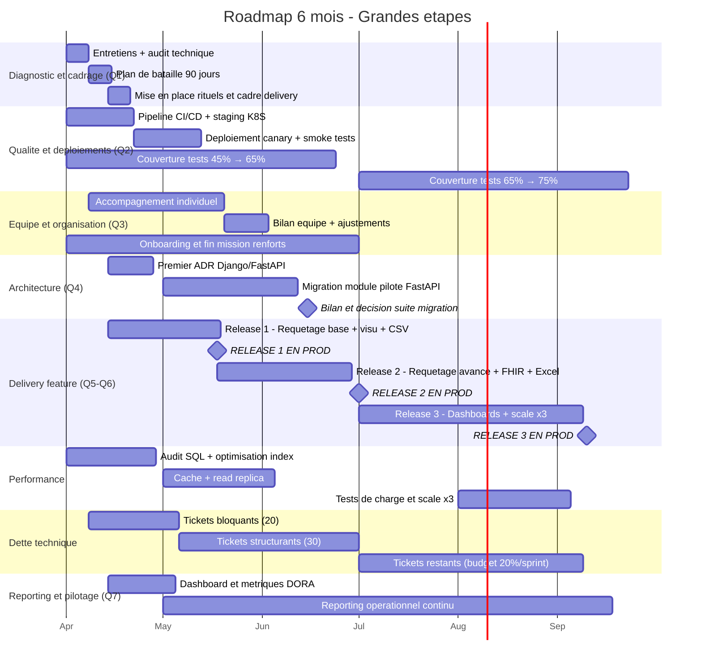

# Proposez une roadmap technique sur 6 mois au format Gantt

## Hypotheses

- Mois 1 = Mois 4 du projet (on reprend le controle apres 3 mois passes)
- Sprints de 2 semaines, equipe de 9 devs + 2 renforts temporaires (mois 1-3)
- Allocation par sprint : 70% features / 20% dette technique / 10% buffer

---

## Gantt - Vue grandes etapes

Les sections reprennent les chantiers evoques dans les reponses precedentes : diagnostic (Q1), qualite et deploiements (Q2), equipe (Q3), architecture (Q4), delivery feature (Q5-Q6), reporting et pilotage (Q7).

---

## Jalons cles

| Jalon | Date cible | Ce qu'on valide |
|-------|-----------|-----------------|
| Cadre delivery en place | Mi-avril | Rituels, CI/CD, staging, plan 90j |
| Release 1 en prod | Mi-mai | Requetage de base, visu, export CSV |
| Bilan equipe | Fin mai | Accompagnement individuel : ca marche ou escalade |
| Decision architecture FastAPI | Mi-juin | Module pilote mesure, decision suite migration |
| Couverture 65% | Fin juin | Mesure automatisee |
| Release 2 en prod | Debut juillet | Requetage complet, FHIR, exports |
| Fin mission renforts | Fin juillet | Transfert de competences fait |
| Release 3 en prod | Mi-septembre | Dashboards, scale x3, plateforme complete |
| Couverture 75% | Fin septembre | Mesure automatisee |

---

## Points de controle (Go / No-Go)

| Date | Decision | Critere |
|------|----------|---------|
| Fin avril | Go Release 1 | CI/CD stable, perf ameliorees, equipe cadree |
| Mi-mai | Go Release 2 | Release 1 en prod sans incident |
| Debut juillet | Go Release 3 | Release 2 en prod, FHIR OK |
| Debut aout | Go scale x3 | Tests de charge OK, monitoring OK |

Chaque Go/No-Go est une decision partagee avec le DSN.

---

**Cette roadmap est une boussole, pas un plan fige. Le detail s'affine sprint apres sprint, mais les grands jalons et les chantiers sont poses.**
